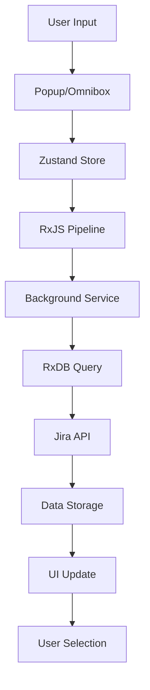
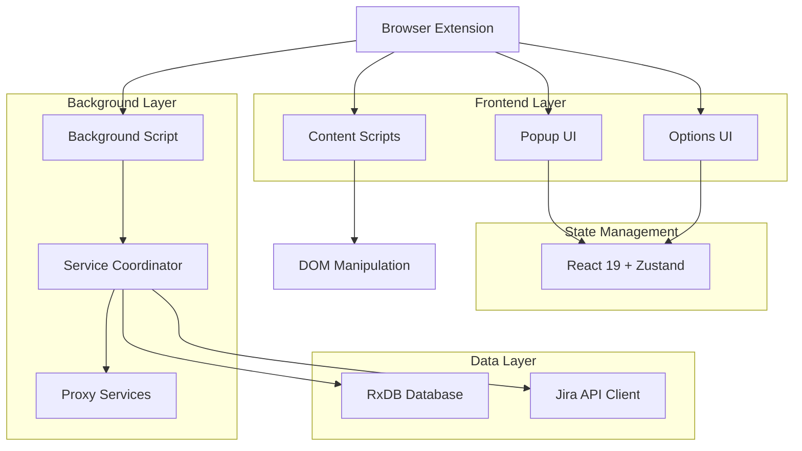
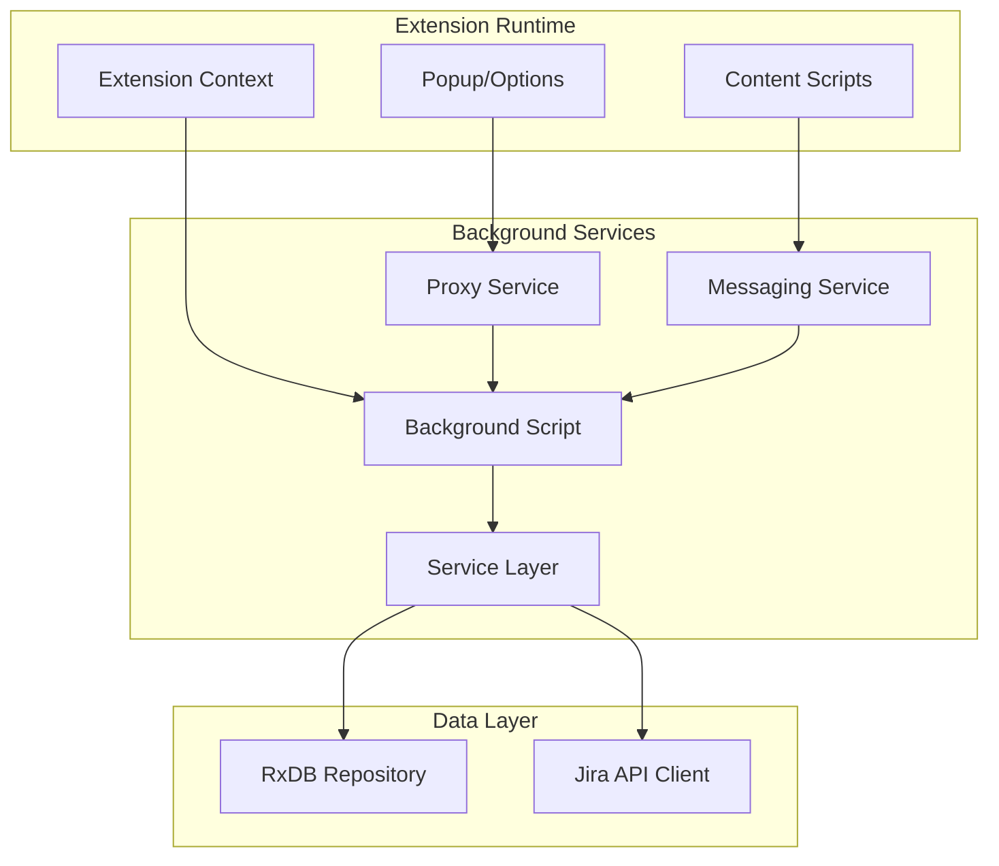
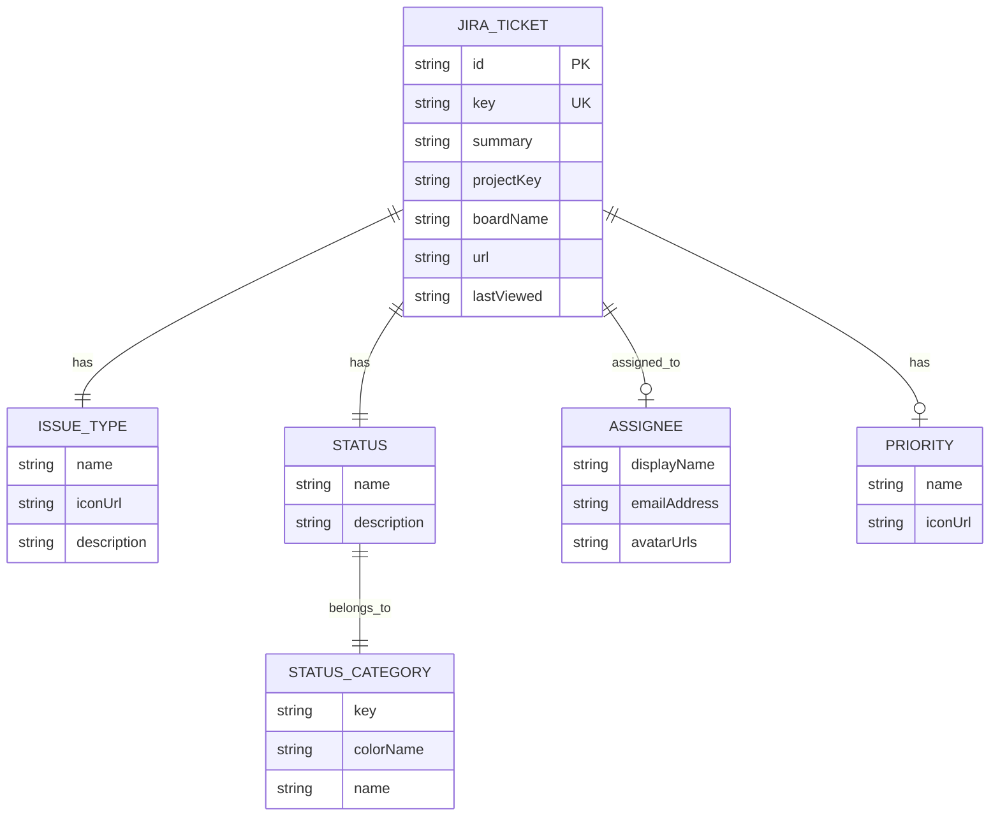

# Fast Track - Architecture Analysis & Documentation

## 1. Product Overview

Fast Track is a browser extension that provides quick search and enhanced access to Jira tickets with improved board experience. Built as an Nx monorepo, it enables users to search tickets by key, summary, assignee, or status with lightning-fast results and keyboard shortcuts.

## 2. Core Features

### 2.1 Feature Module

Our Fast Track extension consists of the following main components:

1. **Quick Search Interface**: Popup with real-time ticket search and keyboard navigation
2. **Options Page**: Configuration interface for Jira API settings and preferences
3. **Background Services**: Ticket data management, API orchestration, and omnibox integration
4. **Content Scripts**: Jira page enhancements including dark mode, card highlighting, and theme management
5. **Omnibox Integration**: Browser address bar search with "jira" keyword

### 2.2 Page Details

| Component       | Module Name         | Feature Description                                                       |
| --------------- | ------------------- | ------------------------------------------------------------------------- |
| Popup           | Quick Search        | Real-time ticket search, keyboard navigation (Alt+J), result highlighting |
| Options         | Configuration       | Jira API setup, host permissions, token management, license management    |
| Background      | Service Coordinator | RxDB initialization, proxy service registration, omnibox handling         |
| Content Scripts | Page Enhancement    | Dark mode toggle, card highlighting, theme management, standup mode       |
| Omnibox         | Search Integration  | Address bar search with "jira" keyword, suggestion display                |

## 3. Core Process

### User Search Flow

1. User opens popup (Alt+J) or uses omnibox ("jira" keyword)
2. Types search query → Zustand state updates
3. RxJS pipeline debounces input → triggers background search
4. Background service queries RxDB → fetches from Jira API if needed
5. Results stored in RxDB → UI subscribes to updates
6. User navigates results with keyboard → opens selected ticket



## 4. User Interface Design

### 4.1 Design Style

- **Primary Colors**: Tailwind CSS with DaisyUI components
- **Button Style**: Rounded corners with hover states
- **Font**: System fonts with Tailwind typography
- **Layout Style**: Card-based design with top navigation
- **Icons**: React Icons library with Jira-specific iconography

### 4.2 Page Design Overview

| Component | Module Name      | UI Elements                                                       |
| --------- | ---------------- | ----------------------------------------------------------------- |
| Popup     | Search Interface | Input field, ticket list, keyboard shortcuts, loading states      |
| Options   | Configuration    | Tabbed navigation, form inputs, connection status, license badges |
| Content   | Page Enhancement | Overlay components, theme toggles, highlighting effects           |

### 4.3 Responsiveness

Desktop-first design with popup constraints (400x600px), touch interaction optimized for extension context.

---

# Technical Architecture Document

## 1. Architecture Design



## 2. Technology Description

- **Frontend**: React@19 + TypeScript + Tailwind CSS + DaisyUI
- **Build System**: WXT Framework + Nx Monorepo
- **State Management**: Zustand with slices pattern
- **Database**: RxDB with in-memory storage
- **API Client**: jira.js for Jira REST API
- **Messaging**: @webext-core/proxy-service
- **Reactive Programming**: RxJS for search orchestration
- **Development**: Vite + ESLint + Prettier + TypeScript

## 3. Route Definitions

| Route           | Purpose                                           |
| --------------- | ------------------------------------------------- |
| popup.html      | Main search interface, quick ticket access        |
| options.html    | Configuration page, API setup, license management |
| background      | Service coordinator, API orchestration            |
| content scripts | Jira page enhancements, DOM manipulation          |

## 4. API Definitions

### 4.1 Core Services

**Search Service**

```typescript
interface SearchService {
  search(query: string): Promise<JiraTicket[]>
}
```

**Ticket Service**

```typescript
interface TicketService {
  fetchTickets(): Promise<JiraTicket[]>
  getTicketByKey(key: string): Promise<JiraTicket | null>
  refreshTickets(): Promise<void>
}
```

**Proxy Service Communication**

```typescript
// Background to UI communication
const [registerSearchService, getSearchService] = defineProxyService(
  'SearchService',
  (database: Database) => new SearchServiceImpl(database)
)
```

## 5. Server Architecture Diagram



## 6. Data Model

### 6.1 Data Model Definition



### 6.2 Data Definition Language

**RxDB Schema Definition**

```typescript
export const issueSchema: RxJsonSchema<JiraTicket> = {
  title: 'Issue schema',
  description: 'Jira issue',
  version: 0,
  primaryKey: 'key',
  type: 'object',
  properties: {
    id: { type: 'string' },
    key: {
      type: 'string',
      maxLength: 255,
      minLength: 1
    },
    summary: { type: 'string' },
    issueType: {
      type: 'object',
      properties: {
        name: { type: 'string' },
        iconUrl: { type: 'string' },
        description: { type: 'string' }
      },
      required: ['name', 'iconUrl', 'description']
    },
    status: {
      type: 'object',
      properties: {
        name: { type: 'string' },
        description: { type: 'string' },
        statusCategory: {
          type: 'object',
          properties: {
            key: { type: 'string' },
            colorName: { type: 'string' },
            name: { type: 'string' }
          },
          required: ['key', 'colorName', 'name']
        }
      },
      required: ['name', 'description', 'statusCategory']
    },
    assignee: {
      type: ['object', 'null'],
      properties: {
        displayName: { type: 'string' },
        emailAddress: { type: 'string' },
        avatarUrls: { type: 'string' }
      },
      required: ['displayName', 'emailAddress', 'avatarUrls']
    },
    priority: {
      type: ['object', 'null'],
      properties: {
        name: { type: 'string' },
        iconUrl: { type: 'string' }
      },
      required: ['name', 'iconUrl']
    },
    projectKey: { type: 'string' },
    boardName: { type: 'string' },
    url: { type: 'string' },
    lastViewed: { type: 'string' }
  },
  required: ['id', 'key', 'summary', 'issueType', 'status']
}
```

**Database Initialization**

```typescript
// RxDB setup with in-memory storage
const database = await createRxDatabase({
  name: 'fast-track',
  storage: wrappedValidateZSchemaStorage({
    storage: getRxStorageMemory()
  }),
  closeDuplicates: true
})

// Collection registration
database.addCollections({
  issues: {
    schema: issueSchema,
    methods: issueDocMethods,
    statics: issueCollectionMethods
  }
})
```

---

## Development Workflow

### Build System

- **WXT Framework**: Modern browser extension development
- **Nx Monorepo**: Scalable development with shared packages
- **Multi-browser Support**: Chrome, Firefox, Edge builds
- **Hot Reloading**: Development mode with live updates

### Code Quality

- **TypeScript**: Strict type checking with ES2022 target
- **ESLint**: Comprehensive linting with custom rules
- **Prettier**: Code formatting with Tailwind plugin
- **Testing**: Jest setup for unit testing

### Extension Features

- **Keyboard Shortcuts**: Alt+J for quick access
- **Omnibox Integration**: "jira" keyword search
- **Host Permissions**: _.atlassian.net/jira_ access
- **Cross-browser Compatibility**: Manifest V3 support

This architecture provides a robust, scalable foundation for the Fast Track extension with modern development practices and efficient data management.
