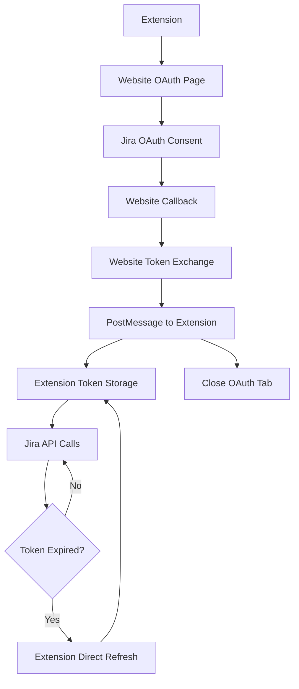

# Jira OAuth Migration Implementation Plan

## 1. Product Overview

This document outlines the simplified migration strategy from manual API key authentication to Jira OAuth for the browser extension. The implementation addresses Jira OAuth's lack of PKCE support by leveraging our website to handle the OAuth flow and immediately pass refresh tokens to the extension for local storage and management.

The migration ensures enhanced security by eliminating the need to store sensitive credentials in the extension while maintaining seamless user experience through extension-managed token refresh and backward compatibility during the transition period.

## 2. Core Features

### 2.1 User Roles

| Role | Registration Method | Core Permissions |
|------|---------------------|------------------|
| Extension User | Browser extension installation | Can authenticate via OAuth, access Jira APIs through secure tokens |
| Website User | OAuth consent flow | Can authorize extension access, manage connected applications |

### 2.2 Feature Module

Our simplified OAuth migration implementation consists of the following main components:

1. **Website OAuth Handler**: Handles OAuth flow and immediately passes refresh token to extension
2. **Extension Token Manager**: Local token storage, automatic refresh, and API authentication
3. **Secure Token Transfer**: One-time secure messaging to pass tokens from website to extension
4. **Error Handling & Recovery**: Extension-side error management and token expiration handling
5. **Backward Compatibility Layer**: Gradual migration support with fallback mechanisms
6. **User Documentation Portal**: Step-by-step guides and troubleshooting resources

### 2.3 Page Details

| Page Name | Module Name | Feature description |
|-----------|-------------|---------------------|
| Website OAuth Handler | Authorization Initiation | Redirect users to Jira OAuth consent page with proper state parameters |
| Website OAuth Handler | Callback Handler | Process authorization codes, exchange for tokens, immediately pass to extension |
| Website OAuth Handler | Token Transfer | Send refresh token to extension via secure postMessage and close window |
| Extension Token Manager | Token Storage | Store refresh tokens securely in extension storage with encryption |
| Extension Token Manager | Token Refresh | Automatically refresh access tokens before expiration using stored refresh token |
| Extension Token Manager | API Authentication | Use access tokens for Jira API calls with automatic retry on expiration |
| Secure Token Transfer | Message Protocol | Implement secure postMessage communication with origin validation |
| Secure Token Transfer | One-time Exchange | Transfer tokens once and immediately clean up communication channel |
| Error Handling & Recovery | Extension Error Detection | Monitor authentication failures and token expiration in extension |
| Error Handling & Recovery | Recovery Mechanisms | Implement automatic retry logic and re-authentication prompts |
| Backward Compatibility Layer | Migration Detection | Detect existing API key users and guide migration process |
| Backward Compatibility Layer | Fallback Support | Maintain API key authentication during transition period |
| User Documentation Portal | Setup Guide | Provide step-by-step OAuth setup instructions |
| User Documentation Portal | Troubleshooting | Offer solutions for common authentication issues |

## 3. Core Process

### Simplified OAuth Authentication Flow

1. User initiates authentication in extension
2. Extension opens website OAuth page in new tab
3. Website redirects to Jira OAuth consent page
4. User grants permissions and Jira redirects back to website
5. Website exchanges authorization code for tokens
6. Website immediately sends refresh token to extension via postMessage
7. Extension stores refresh token securely in local storage
8. Website closes the OAuth tab automatically
9. Extension uses refresh token to get access tokens for API calls

### Extension-Managed Token Refresh Flow

1. Extension monitors access token expiration
2. Before expiration, extension directly calls Jira token refresh endpoint
3. Extension uses stored refresh token to obtain new access token
4. Extension updates local token storage with new tokens
5. Extension continues API calls with fresh access token

## 4. User Interface Design

### 4.1 Design Style

- **Primary Colors**: Blue (#0052CC) for Jira branding consistency, Green (#36B37E) for success states
- **Secondary Colors**: Gray (#97A0AF) for secondary text, Red (#DE350B) for error states
- **Button Style**: Rounded corners (8px), solid fills with hover states
- **Font**: System fonts (SF Pro on macOS, Segoe UI on Windows) with 14px base size
- **Layout Style**: Card-based design with clean spacing and clear visual hierarchy
- **Icons**: Feather icons for consistency, lock icons for security indicators

### 4.2 Page Design Overview

| Page Name | Module Name | UI Elements |
|-----------|-------------|-------------|
| OAuth Authorization Flow | Authorization Button | Primary blue button with Jira logo, "Connect with Jira" text |
| OAuth Authorization Flow | Progress Indicator | Step-by-step progress bar showing current authentication stage |
| Token Management System | Status Indicator | Green checkmark for active connection, yellow warning for expiring tokens |
| Token Management System | Refresh Button | Secondary button for manual token refresh with loading spinner |
| Error Handling & Recovery | Error Messages | Red alert boxes with clear error descriptions and action buttons |
| Error Handling & Recovery | Retry Interface | Prominent retry button with countdown timer for automatic retries |
| User Documentation Portal | Setup Wizard | Modal overlay with numbered steps and visual screenshots |
| User Documentation Portal | Help Center | Expandable FAQ sections with search functionality |

### 4.3 Responsiveness

The implementation is desktop-first with mobile-adaptive design for the website components. The browser extension maintains consistent UI across different screen sizes with responsive popup dimensions.

## 5. Implementation Steps

### Phase 1: Website OAuth Handler Setup

1. **OAuth Application Registration**
   - Register application with Jira Cloud
   - Configure redirect URIs pointing to website
   - Obtain client ID and securely store client secret

2. **OAuth Page Development**
   - Create `/auth/jira` page for OAuth flow initiation
   - Implement `/auth/jira/callback` for authorization code handling
   - Add immediate token transfer via postMessage
   - Implement automatic tab closure after token transfer

3. **Security Implementation**
   - Generate cryptographically secure state parameters
   - Implement CSRF protection
   - Add origin validation for postMessage
   - Enable HTTPS-only communication

### Phase 2: Extension Token Manager

1. **Local Token Storage**
   - Implement secure storage in extension's storage API
   - Use Web Crypto API for token encryption
   - Store refresh tokens with expiration metadata
   - Implement secure key management

2. **Token Lifecycle Management**
   - Build automatic refresh logic (refresh 5 minutes before expiration)
   - Implement direct Jira API token refresh calls
   - Add token validation and health checks
   - Create local token cleanup mechanisms

### Phase 3: Secure Token Transfer

1. **PostMessage Communication**
   - Implement secure postMessage protocol with origin validation
   - Use one-time message exchange for token transfer
   - Add message authentication and encryption
   - Implement timeout and error handling

2. **Extension Integration**
   - Modify extension to listen for OAuth tokens from website
   - Implement token storage in extension's secure storage
   - Add automatic token refresh using stored refresh tokens
   - Create fallback mechanisms for network failures

### Phase 4: Error Handling & Recovery

1. **Extension Error Detection**
   - Monitor HTTP 401/403 responses from Jira API
   - Track token refresh failures in extension
   - Detect network connectivity issues
   - Log authentication state changes locally

2. **Recovery Mechanisms**
   - Implement exponential backoff for retry attempts
   - Provide clear user notifications for auth failures
   - Add manual re-authentication triggers that open website OAuth
   - Create graceful degradation for offline scenarios

### Phase 5: Backward Compatibility

1. **Migration Detection**
   - Detect existing API key configurations
   - Provide migration prompts and guidance
   - Maintain API key functionality during transition
   - Track migration completion rates

2. **Gradual Rollout**
   - Implement feature flags for OAuth enablement
   - Support both authentication methods simultaneously
   - Provide easy rollback mechanisms
   - Monitor system stability during migration

### Phase 6: Documentation & User Support

1. **User Documentation**
   - Create step-by-step setup guides with screenshots
   - Develop troubleshooting documentation
   - Build FAQ section for common issues
   - Provide video tutorials for complex scenarios

2. **Developer Documentation**
   - Document API endpoints and authentication flows
   - Create integration examples and code samples
   - Provide security best practices guide
   - Maintain changelog for authentication updates

## 6. Security Considerations

### Token Security
- Use short-lived access tokens (1 hour expiration)
- Implement secure refresh token rotation
- Store tokens encrypted at rest
- Transmit tokens only over HTTPS

### Communication Security
- Validate all messages between extension and website
- Use CORS policies to restrict cross-origin requests
- Implement request signing to prevent tampering
- Add rate limiting to prevent abuse

### Privacy Protection
- Minimize data collection and storage
- Implement data retention policies
- Provide user control over data deletion
- Ensure GDPR compliance for EU users

## 7. Testing Strategy

### Unit Testing
- Test OAuth flow components individually
- Validate token encryption/decryption
- Test error handling scenarios
- Verify security parameter generation

### Integration Testing
- Test complete OAuth flow end-to-end
- Validate extension-website communication
- Test token refresh mechanisms
- Verify backward compatibility

### Security Testing
- Perform penetration testing on OAuth endpoints
- Test for common OAuth vulnerabilities
- Validate encryption implementation
- Test rate limiting and abuse prevention

## 8. Deployment Plan

### Pre-deployment
1. Complete security audit of OAuth implementation
2. Perform load testing on proxy endpoints
3. Validate backup and recovery procedures
4. Prepare rollback plans

### Deployment Phases
1. **Beta Release**: Deploy to limited user group
2. **Gradual Rollout**: Increase user percentage weekly
3. **Full Deployment**: Complete migration for all users
4. **Legacy Cleanup**: Remove API key support after migration

### Post-deployment
1. Monitor authentication success rates
2. Track user adoption metrics
3. Collect user feedback and iterate
4. Maintain security monitoring and updates

This comprehensive plan ensures a secure, user-friendly migration from API key to OAuth authentication while maintaining system reliability and user trust throughout the transition period.