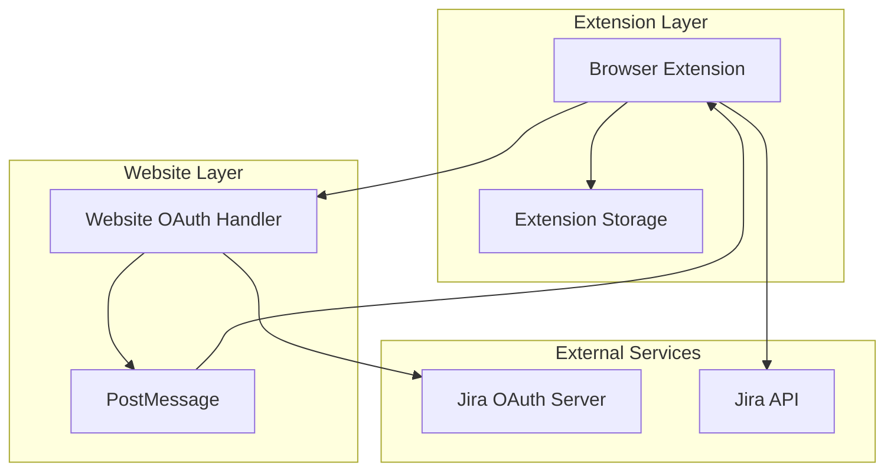
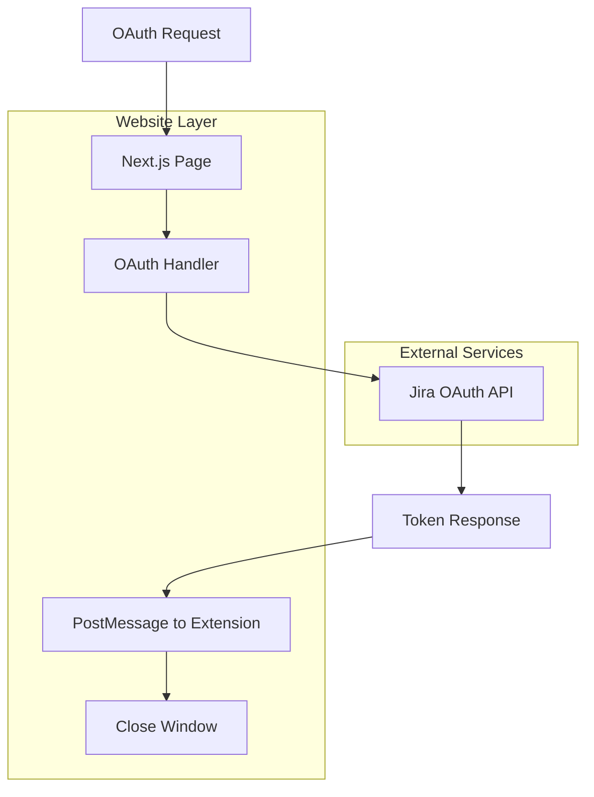
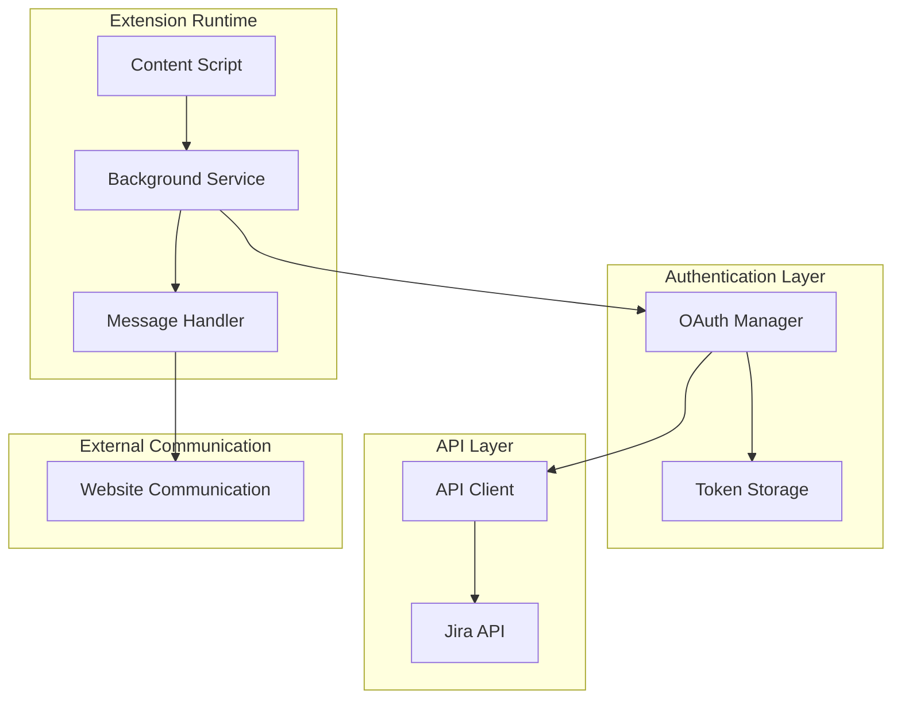

# Jira OAuth Migration Technical Architecture

## 1. Architecture Design



## 2. Technology Description

- Frontend: React@18 + TypeScript + Tailwind CSS + Vite (Website)
- Extension: WXT Framework + TypeScript + WebExt Core
- Website: Next.js@14 + TypeScript (OAuth handler only)
- Storage: Extension Storage API + Web Crypto API
- Authentication: Jira OAuth 2.0 Authorization Code Flow
- Communication: PostMessage API for token transfer

## 3. Route Definitions

| Route | Purpose |
|-------|---------|
| /auth/jira | OAuth initiation page, redirects to Jira consent page |
| /auth/jira/callback | Handles OAuth callback, exchanges code for tokens, sends to extension |
| /docs/oauth-setup | User documentation for OAuth setup process |

## 4. API Definitions

### 4.1 Core API

#### OAuth Flow Initiation
```
GET /auth/jira
```

Query Parameters:
| Param Name | Param Type | isRequired | Description |
|------------|------------|------------|-------------|
| extension_id | string | true | Unique identifier for the extension instance |

Behavior:
- Generates secure state parameter
- Redirects to Jira OAuth authorization URL
- Stores extension_id and state in session for callback

#### OAuth Callback Handler
```
GET /auth/jira/callback
```

Query Parameters:
| Param Name | Param Type | isRequired | Description |
|------------|------------|------------|-------------|
| code | string | true | Authorization code from Jira |
| state | string | true | State parameter for CSRF protection |

Behavior:
- Validates state parameter
- Exchanges authorization code for tokens
- Sends refresh token to extension via postMessage
- Closes the OAuth window automatically

#### PostMessage Token Transfer

Message sent from website to extension:
```javascript
{
  type: 'JIRA_OAUTH_SUCCESS',
  data: {
    refresh_token: string,
    access_token: string,
    expires_at: string, // ISO timestamp
    user_info: {
      account_id: string,
      email: string,
      display_name: string
    }
  },
  origin: 'https://your-website.com'
}
```

#### Extension Token Refresh (Direct to Jira)

Extension directly calls Jira API:
```
POST https://auth.atlassian.com/oauth/token
```

Request:
| Param Name | Param Type | isRequired | Description |
|------------|------------|------------|-------------|
| grant_type | string | true | Must be 'refresh_token' |
| client_id | string | true | Jira OAuth client ID |
| refresh_token | string | true | Stored refresh token |

Response:
| Param Name | Param Type | Description |
|------------|------------|-------------|
| access_token | string | New access token |
| refresh_token | string | New refresh token (rotated) |
| expires_in | number | Token expiration time in seconds |

## 5. Simplified Website Architecture



## 6. Extension Storage Schema

### 6.1 Extension Storage Structure

```typescript
interface ExtensionOAuthStorage {
  auth: {
    type: 'oauth' | 'api_key' | null;
    tokens?: {
      access_token: string; // Encrypted
      refresh_token: string; // Encrypted
      expires_at: string; // ISO timestamp
      token_type: 'Bearer';
    };
    user_info?: {
      account_id: string;
      email: string;
      display_name: string;
      avatar_url?: string;
    };
    last_refresh: string; // ISO timestamp
    client_id: string; // Jira OAuth client ID
  };
  settings: {
    auto_refresh: boolean;
    notification_enabled: boolean;
    migration_completed: boolean;
  };
}
```

### 6.2 Session Storage (Website)

```typescript
interface OAuthSession {
  state: string;
  extension_id: string;
  created_at: string;
  expires_at: string;
}
```

Stored temporarily in browser session storage during OAuth flow, automatically cleaned up after token transfer.

## 7. Extension Architecture

### 7.1 Extension Components



### 7.2 Extension Storage Schema

```typescript
interface ExtensionStorage {
  auth: {
    type: 'oauth' | 'api_key' | null;
    tokens?: {
      access_token: string; // Encrypted
      refresh_token: string; // Encrypted
      expires_at: string; // ISO timestamp
    };
    user_info?: {
      account_id: string;
      email: string;
      display_name: string;
    };
    last_refresh: string; // ISO timestamp
  };
  settings: {
    auto_refresh: boolean;
    notification_enabled: boolean;
    migration_completed: boolean;
  };
}
```

## 8. Security Implementation

### 8.1 Extension Token Encryption

- **Token Encryption**: Web Crypto API with AES-GCM encryption
- **Key Derivation**: PBKDF2 with extension-specific salt
- **Storage**: Extension storage API with encrypted values
- **Key Management**: Derived from extension ID and user context

### 8.2 Communication Security

- **PostMessage Security**: Origin validation for website communication
- **One-time Transfer**: Tokens transferred once and channel closed
- **State Validation**: CSRF protection with secure random state
- **HTTPS Only**: All communication over secure connections

### 8.3 Token Security

- **Access Token Lifetime**: 1 hour (managed by Jira)
- **Refresh Token Lifetime**: 90 days with automatic rotation
- **Local Storage**: Encrypted storage in extension with automatic cleanup
- **Direct Refresh**: Extension directly calls Jira API for token refresh

### 8.4 Website Security

- **Session Management**: Temporary session storage with automatic cleanup
- **Client Secret**: Securely stored in environment variables
- **Rate Limiting**: Protection against OAuth abuse
- **CORS Configuration**: Strict origin validation for extension communication

This simplified architecture ensures secure OAuth implementation while eliminating database complexity and maintaining all security best practices.