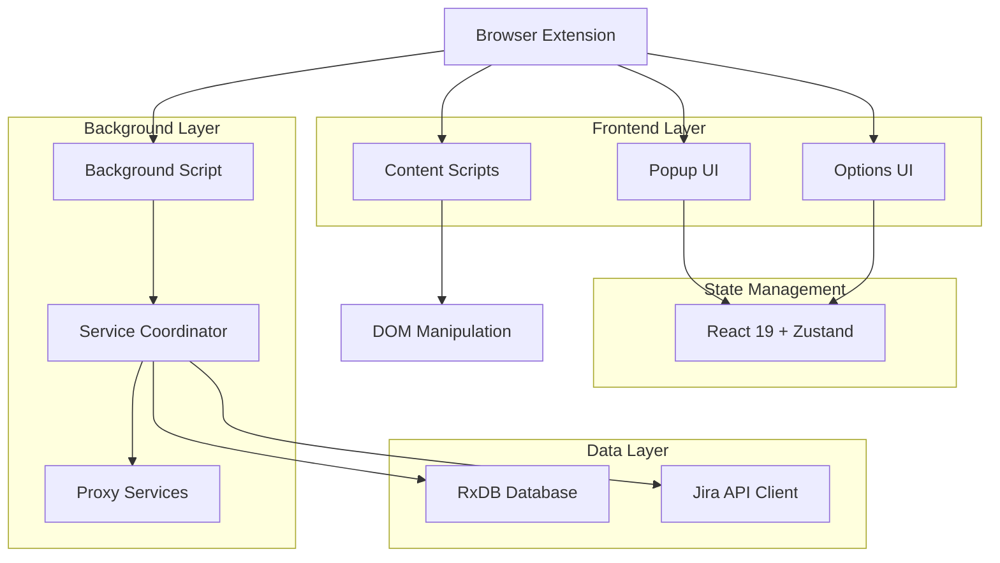
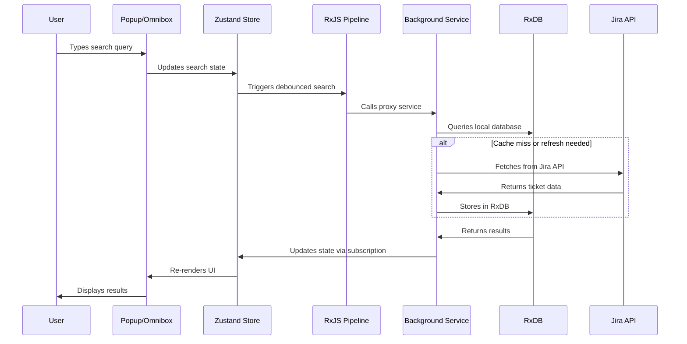

# Fast Track - Comprehensive Architecture Documentation

## Project Overview

Fast Track is a modern browser extension built as an Nx monorepo that provides lightning-fast search and enhanced access to Jira tickets. The extension enables users to quickly search tickets by key, summary, assignee, or status with keyboard shortcuts and real-time results.

The system implements a comprehensive OAuth flow for secure authentication, custom event-based communication between extension and website components, and follows SOLID principles with clean code practices throughout the codebase.

**Tech Stack:**

- **Frontend**: React 19 + TypeScript + Tailwind CSS + DaisyUI
- **Build System**: WXT Framework + Nx Monorepo + Vite
- **State Management**: Zustand with slices pattern
- **Database**: RxDB with in-memory storage and Z-Schema validation
- **API Integration**: jira.js client with authentication
- **Messaging**: @webext-core/proxy-service for cross-context communication
- **Reactive Programming**: RxJS for search orchestration
- **Development**: ESLint + Prettier + TypeScript strict mode
- **Website**: Next.js React framework for the companion website

**Authentication & Security:**

- **OAuth 2.0**: Secure authentication flow
- **Custom Event System**: Secure communication between extension and website
- **Token Management**: Secure storage and handling of authentication tokens

## Architecture Patterns

### Browser Extension Architecture



### Runtime Topology

- **Background Script** (`apps/extension/src/entrypoints/background/`): Service coordinator that initializes RxDB, registers proxy services, handles omnibox integration, and manages installation events
- **Content Scripts** (`apps/extension/src/entrypoints/*.content.ts`): Lightweight modules injected into Jira pages for dark mode, card highlighting, theme management, and ticket collection
  - **OAuth Callback Handler**: Manages secure authentication flow completion
  - **Extension Communicator**: Facilitates secure message passing between components
- **UI Applications**:
  - **Popup** (`apps/extension/src/entrypoints/popup/`): React 19 app for quick search with keyboard navigation
  - **Options** (`apps/extension/src/entrypoints/options/`): Configuration interface for API setup and preferences
- **Website Integration**:
  - **OAuth Flow Management**: Handles secure authentication with Jira Cloud
  - **Extension Communication**: Custom event system for secure data exchange
  - **Configuration Interface**: Web-based setup and management tools

## Data Layer Architecture

### RxDB Database Design

```typescript
// Database initialization with in-memory storage
const database = await createRxDatabase({
  name: 'fast-track',
  storage: wrappedValidateZSchemaStorage({
    storage: getRxStorageMemory()
  }),
  closeDuplicates: true
})
```

### Schema Definitions

- **Primary Collection**: `issues` with typed JiraTicket schema
- **Validation**: Z-Schema validation for data integrity
- **Storage**: In-memory storage for performance
- **Methods**: Document and collection-level methods for business logic

### Data Flow (Enhanced Search System)



## State Management with Zustand

### Store Architecture

```typescript
// Combined store with slices pattern
export type TicketStore = SearchSlice & NavigationSlice

export const useTicketStore = create<TicketStore>()()
  devtools(
    (...a) => ({
      ...createSearchSlice(...a),
      ...createNavigationSlice(...a)
    }),
    { name: 'ticket-store' }
  )
)
```

### State Slices

- **SearchSlice**: Manages search query, results, loading states, and error handling
- **NavigationSlice**: Handles keyboard navigation, selection index, and result traversal
- **Selectors**: Optimized selectors with `useShallow` for performance

### UI Components & Hooks

- **Components**: Dumb React 19 components focused on presentation
- **Custom Hooks**: Business logic encapsulation (`useTicketSearch`, `useJiraConfig`, `useLicense`)
- **Utilities**: Pure helper functions in `apps/extension/src/utils/` for search scoring, caching, and page observation

## Storage Layer

- **Core**: `apps/extension/src/lib/storage/` with typed storage abstraction
- **Capabilities**: `get/set/remove` operations, batched updates, live change subscriptions
- **Security**: Token handling with secure storage, no logging of sensitive data
- **Schema**: Typed value schemas in `storage/schema.ts` with validation

## API Integration

### Jira.js Client

```typescript
export class JiraClient extends BaseClient {
  issues = new Issues(this)
  issueSearch = new IssueSearch(this)
  myself = new Myself(this)
  projects = new Projects(this)
  serverInfo = new ServerInfo(this)

  constructor(private jiraConfig: JiraApiConfig) {
    super({
      host: jiraConfig.baseUrl,
      authentication: {
        basic: {
          email: jiraConfig.email,
          apiToken: jiraConfig.apiToken
        }
      }
    })
  }
}
```

### Authentication & Security

- **Basic Auth**: Email + API token authentication
- **Host Permissions**: `https://*.atlassian.net/jira*` for Atlassian Cloud
- **Token Storage**: Secure storage with no logging of sensitive data
- **Configuration**: Dynamic client reconfiguration support

## Search System Architecture

### RxJS Search Orchestration

- **Debouncing**: Input debouncing to prevent excessive API calls
- **Cancellation**: `switchMap` for canceling in-flight requests
- **Caching**: Intelligent caching with RxDB for offline capability
- **Error Handling**: Graceful error handling with user feedback

### Search Service Implementation

```typescript
class SearchServiceImpl {
  async search(query: string): Promise<JiraTicket[]> {
    if (!query) return this.database.issues.find().limit(10).exec()
    return this.database.issues.find().where('summary').regex(query).exec()
  }
}
```

## Messaging & Cross-Context Communication

### Proxy Service Pattern

```typescript
// Service registration in background
const [registerSearchService, getSearchService] = defineProxyService(
  'SearchService',
  (database: Database) => new SearchServiceImpl(database)
)

// Usage in UI contexts
const searchService = getSearchService()
const results = await searchService.search(query)
```

### Communication Architecture

- **Background ↔ UI**: Proxy services for type-safe communication
- **Content Scripts**: Lightweight messaging for DOM interaction
- **Service Coordination**: Background script as central coordinator
- **Cleanup**: Automatic listener cleanup and memory management

## Build System & Development

### WXT Framework Configuration

```typescript
export default defineConfig({
  srcDir: 'src',
  modules: ['@wxt-dev/module-react', '@wxt-dev/auto-icons'],
  manifest: {
    name: 'Fast Track',
    host_permissions: ['https://*.atlassian.net/jira*'],
    omnibox: { keyword: 'jira' },
    permissions: ['storage', 'tabs'],
    commands: {
      _execute_action: {
        suggested_key: { default: 'Alt+J', mac: 'Alt+J' }
      }
    }
  }
})
```

### Multi-Browser Support

- **Output Targets**: `chromium-mv3`, `chrome-mv3`, `firefox-mv2`, `edge-mv3`
- **Development Builds**: Hot reloading with `*-dev` variants
- **Browser-Specific**: Conditional manifest properties and polyfills

### Nx Monorepo Integration

- **Project Structure**: `apps/extension` and `apps/website` with shared `packages/logger`
- **Build Targets**: Defined in `apps/extension/project.json` and `apps/website/project.json`
- **Scripts**: Root-level scripts proxy to Nx targets
- **Linting**: Unified ESLint configuration with flat config (excludes .next directory for website)
- **CI/CD**: Automated builds and artifact uploads
- **Code Quality Tools**: TypeScript strict mode, comprehensive linting rules with project-specific exclusions

## Extension Features

### User Interface

- **Popup**: Quick search with keyboard navigation (Alt+J)
- **Options**: Configuration page with tabbed interface
- **Omnibox**: Address bar integration with "jira" keyword
- **Keyboard Shortcuts**: Full keyboard navigation support

### Page Observation

- **SPA Navigation**: `PageObserver` for Jira's single-page application
- **Effect Registration**: Unique keys with cleanup-enabled effects
- **DOM Monitoring**: Automatic re-application on route changes

### Content Script Features

- **Dark Mode**: Theme management and persistence
- **Card Highlighting**: Visual enhancements for ticket cards
- **Standup Mode**: Specialized view for daily standups
- **Ticket Collection**: DOM extraction of ticket information

## Development Workflow

### Code Quality

- **TypeScript**: Strict mode with ES2022 target
- **ESLint**: Comprehensive rules with Prettier integration
- **Testing**: Jest setup for unit and integration tests
- **Type Safety**: End-to-end type safety from API to UI

### Extension Development

- **Hot Reloading**: Live updates during development
- **Debug Mode**: Development-only features and logging
- **Multi-Browser Testing**: Concurrent development across browsers
- **Manifest Validation**: Automatic validation and optimization

## Extending the Architecture

### Adding New Features

1. **Content Scripts**: Create `apps/extension/src/entrypoints/<feature>.content.ts`
2. **Services**: Add to `apps/extension/src/services/` with proxy service registration
3. **UI Components**: React components in `apps/extension/src/components/`
4. **State Management**: New Zustand slices for complex state

### Best Practices

- **Service Isolation**: Keep services focused and testable
- **Type Safety**: Leverage TypeScript for API contracts
- **Performance**: Use RxJS for reactive programming patterns
- **Security**: Follow extension security best practices
- **Testing**: Write tests for critical business logic

This architecture provides a robust, scalable foundation for the Fast Track extension with modern development practices, efficient data management, and excellent developer experience.
